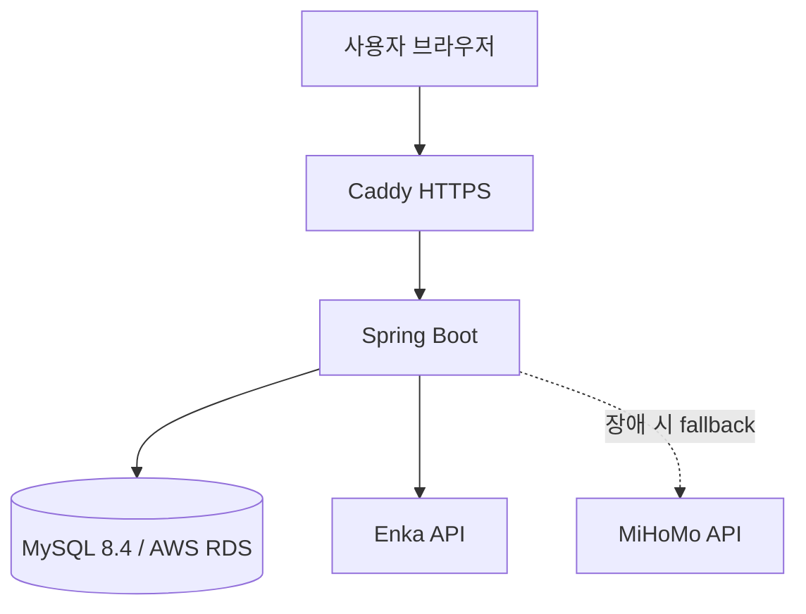

# 붕스청문회

> 동시 투표의 데이터 정합성과 외부 프로필 API 장애 대응을 고려해 운영 환경까지 구축한 Spring Boot 커뮤니티 서비스

[](https://github.com/tms569111-wq/starrail-community/actions/workflows/ci.yml)
[](https://openjdk.org/projects/jdk/21/)
[](https://spring.io/projects/spring-boot)
[](https://dev.mysql.com/doc/refman/8.4/en/)

[서비스 바로가기](https://37tiervote.com) · [문제 해결 기록](docs/ENGINEERING_NOTES.md) · [배포 문서](docs/DEPLOYMENT.md)

붕괴: 스타레일 캐릭터를 버전과 돌파 단계별로 평가하고 의견을 나누는 비공식 커뮤니티입니다. 개인 프로젝트로 기획부터 백엔드·화면 구현, 테스트, AWS 배포와 운영 설정까지 진행했습니다.

## 핵심 문제 해결

| 문제 | 해결 | 검증 |
|---|---|---|
| 동일 UID 요청이 한꺼번에 들어오면 외부 API와 서버 대기열이 함께 소진됨 | TTL 캐시, UID별 single-flight, 전체 동시 처리·대기 상한, 공급자별 circuit breaker와 fallback 적용 | 동일 UID 200개 요청 전부 성공, 실제 외부 호출 1회. 서로 다른 UID 200개는 실행 8개·대기 30개만 수용하고 나머지는 즉시 제한 |
| 동시 투표에서 조회 후 삽입 방식만으로는 중복 행이 생길 수 있음 | `(member_id, poll_id)` 유니크 제약과 MySQL `ON DUPLICATE KEY UPDATE`로 DB가 최종 정합성을 보장 | MySQL 8.4 Testcontainers 동시성 통합 테스트 |
| 외부 API 실패 후 사용자 쿨다운 예약이 간헐적으로 남음 | 로그로 Enka timeout과 MiHoMo 500을 구분하고, MySQL `DATETIME(6)`과 Java 나노초 정밀도 차이를 마이크로초 기준으로 보정 | timeout·fallback·쿨다운 해제 회귀 테스트 |
| 과도한 페이지 조회와 DB 연결 대기가 장애를 키울 수 있음 | 페이지·배치 크기, Hikari 풀, 쿼리 시간, Tomcat 연결·스레드·대기열에 상한 설정 | 일시적 DB 포화는 일반 500 대신 재시도 가능한 503으로 처리 |

구체적인 원인 분석과 선택 근거는 [ENGINEERING_NOTES.md](docs/ENGINEERING_NOTES.md)에 정리했습니다.

## 주요 기능

- 버전·돌파 단계별 캐릭터 투표와 티어 집계
- UID 기반 공개 프로필 조회와 보유 캐릭터 확인
- 댓글·답글·추천·신고 및 사용자 제재
- 이상중재 브론즈·실버·골드·플래티넘 칭호 신청
- 신고·칭호·회원·운영 기록을 분리한 운영자 화면
- 버전 종료 후 과거 티어·댓글을 유지하는 읽기 전용 기록

## 아키텍처



- Caddy가 TLS 인증서, HTTP→HTTPS 전환, 리버스 프록시와 보안 헤더를 담당합니다.
- 애플리케이션 포트는 운영 서버의 `127.0.0.1:8080`에만 바인딩합니다.
- Flyway가 빈 DB와 기존 DB 모두에 같은 순서로 스키마 변경을 적용합니다.
- 외부 프로필 조회는 Enka를 우선 사용하고 실패하면 MiHoMo를 시도합니다.
- 캐시와 요청 제한은 단일 인스턴스 JVM 기준이며, 다중 인스턴스로 확장할 때는 Redis 등 공유 저장소가 필요합니다.

## 기술 스택

| 영역 | 기술 | 사용 목적 |
|---|---|---|
| Backend | Java 21, Spring Boot 4.1, Spring MVC | 서비스와 웹 요청 처리 |
| Security | Spring Security, Google OAuth 2.0/OIDC | 로그인과 권한 분리 |
| Data | Spring Data JPA, MySQL 8.4, Flyway | 영속성, 정합성, 스키마 버전 관리 |
| Test | JUnit, Spring Boot Test, Testcontainers | 단위·웹·실제 MySQL 통합 테스트 |
| Deploy | Docker Compose, Caddy, AWS EC2·RDS | 컨테이너 실행, HTTPS, 운영 DB |
| View | Thymeleaf, JavaScript, CSS | 서버 렌더링 화면과 반응형 UI |

조회 화면에서는 `EntityGraph`와 일괄 `IN` 조회 후 Map 매핑을 사용해 연관 데이터를 반복 조회하는 N+1 문제를 줄였습니다.

## 테스트와 CI

GitHub Actions는 다음 항목을 순서대로 검증합니다.

1. Java 21 전체 테스트
2. 운영 Docker Compose 설정 검증
3. Caddy 설정 검증
4. Docker 이미지 빌드
5. MySQL 8.4와 애플리케이션 기동
6. `/actuator/health` 응답 확인 후 테스트 볼륨 정리

추가로 [k6 공개 페이지 부하 시나리오](load-tests/public-pages.js)를 관리합니다. 저장소에 실행 결과가 없는 수치는 성과로 기재하지 않았습니다.

## 로컬 실행

Java 21과 Docker가 필요합니다.

```bash
cp .env.example .env
```

`.env`에서 Google OAuth 클라이언트 값과 운영자 Google `sub`를 입력한 뒤 실행합니다.

```bash
docker compose up --build
```

애플리케이션은 [http://localhost:8080](http://localhost:8080)에서 확인할 수 있습니다.

## 운영 설정

- 실제 비밀번호, OAuth secret과 RDS 주소는 Git에 저장하지 않고 서버의 `.env`에서 주입합니다.
- 운영 DB 연결 예시는 TLS를 강제하는 `sslMode=REQUIRED`를 사용합니다.
- DB 풀, 서버 처리량, 외부 API timeout·캐시·동시 요청 상한을 환경변수로 조절할 수 있습니다.
- 컨테이너는 비루트 사용자로 실행하며 업로드 파일과 Caddy 데이터는 Docker volume에 보존합니다.

자세한 순서는 [DEPLOYMENT.md](docs/DEPLOYMENT.md), 외부 API 설정은 [enka-traffic-guard.md](docs/enka-traffic-guard.md)를 참고하세요.

## 문서

- [문제 해결과 기술적 의사결정](docs/ENGINEERING_NOTES.md)
- [AWS EC2·RDS 배포 및 장애 확인](docs/DEPLOYMENT.md)
- [Enka API 트래픽 보호 설정](docs/enka-traffic-guard.md)
- [R2 캐릭터 이미지 이관 도구](docs/r2-character-assets-migration.md) — 기본 dry-run, 실제 이관 완료로 표기하지 않음
- [제3자 서비스·리소스 고지](THIRD_PARTY_NOTICES.md)

## Notice

이 저장소는 개인이 만든 팬 프로젝트이며 HoYoverse와 관련이 없습니다. 게임 명칭, 캐릭터와 이미지에 관한 권리는 각 권리자에게 있습니다. UID 조회에는 Enka Network와 MiHoMo의 공개 프로필 데이터를 사용하며 외부 서비스 상태에 따라 조회가 제한될 수 있습니다.
